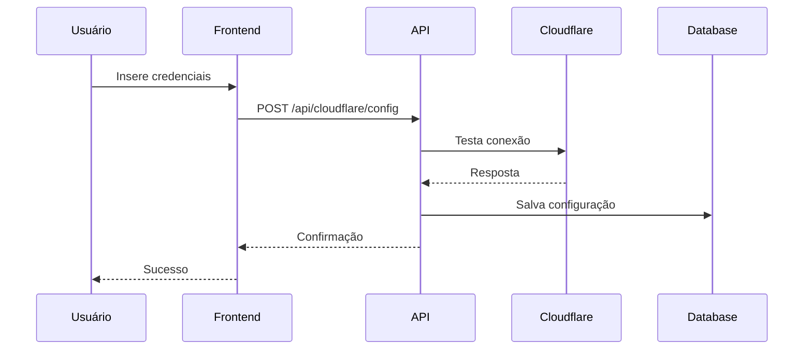
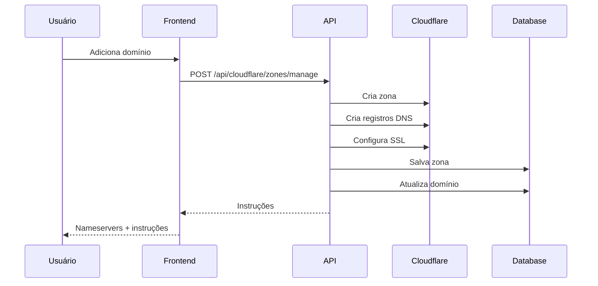
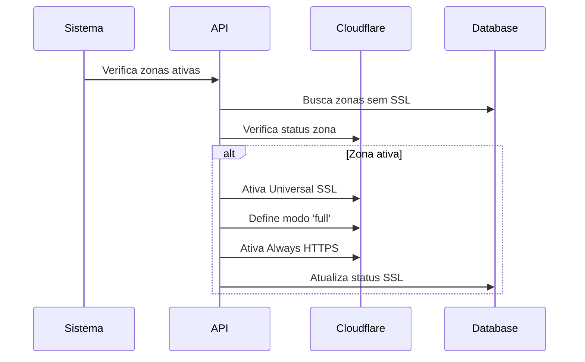

# Integração Cloudflare - Documentação Técnica

Esta documentação descreve a implementação completa da integração com Cloudflare no sistema de checkout.

## Arquitetura

### Componentes Principais

```
┌─────────────────────────────────────────────────────────────┐
│                    Frontend (React)                        │
├─────────────────────────────────────────────────────────────┤
│ • CloudflareIntegrationPage                                 │
│ • SSLManager Component                                      │
│ • Domain Management UI                                      │
└─────────────────────────────────────────────────────────────┘
                              │
                              ▼
┌─────────────────────────────────────────────────────────────┐
│                   API Routes (Next.js)                     │
├─────────────────────────────────────────────────────────────┤
│ • /api/cloudflare/config                                    │
│ • /api/cloudflare/zones/manage                              │
│ • /api/cloudflare/dns                                       │
│ • /api/cloudflare/ssl                                       │
│ • /api/cloudflare/zones/ssl-check                           │
└─────────────────────────────────────────────────────────────┘
                              │
                              ▼
┌─────────────────────────────────────────────────────────────┐
│                 Business Logic Layer                        │
├─────────────────────────────────────────────────────────────┤
│ • cloudflare-config.ts                                      │
│ • SSL automation functions                                  │
│ • DNS management functions                                  │
└─────────────────────────────────────────────────────────────┘
                              │
                              ▼
┌─────────────────────────────────────────────────────────────┐
│                    Database (PostgreSQL)                   │
├─────────────────────────────────────────────────────────────┤
│ • cloudflare_config                                         │
│ • cloudflare_zones                                          │
│ • cloudflare_dns_records                                    │
│ • dominios (updated)                                        │
└─────────────────────────────────────────────────────────────┘
                              │
                              ▼
┌─────────────────────────────────────────────────────────────┐
│                   Cloudflare API                            │
├─────────────────────────────────────────────────────────────┤
│ • Zone Management                                           │
│ • DNS Records                                               │
│ • SSL/TLS Settings                                          │
└─────────────────────────────────────────────────────────────┘
```

## Estrutura do Banco de Dados

### Tabela: cloudflare_config
```sql
CREATE TABLE cloudflare_config (
  id UUID PRIMARY KEY DEFAULT gen_random_uuid(),
  id_loja UUID NOT NULL REFERENCES loja_admin(id),
  api_token TEXT NOT NULL,
  email TEXT,
  zone_name TEXT NOT NULL,
  zone_id TEXT,
  account_id TEXT,
  ativo BOOLEAN DEFAULT true,
  createdAt TIMESTAMP DEFAULT CURRENT_TIMESTAMP,
  updatedAt TIMESTAMP DEFAULT CURRENT_TIMESTAMP
);
```

### Tabela: cloudflare_zones
```sql
CREATE TABLE cloudflare_zones (
  id UUID PRIMARY KEY DEFAULT gen_random_uuid(),
  config_id UUID NOT NULL REFERENCES cloudflare_config(id),
  cloudflare_id TEXT NOT NULL,
  name TEXT NOT NULL,
  status TEXT NOT NULL,
  nameservers TEXT[],
  ssl_enabled BOOLEAN DEFAULT false,
  ssl_mode TEXT,
  ssl_activated_at TIMESTAMP,
  always_use_https BOOLEAN DEFAULT false,
  createdAt TIMESTAMP DEFAULT CURRENT_TIMESTAMP,
  updatedAt TIMESTAMP DEFAULT CURRENT_TIMESTAMP
);
```

### Tabela: cloudflare_dns_records
```sql
CREATE TABLE cloudflare_dns_records (
  id UUID PRIMARY KEY DEFAULT gen_random_uuid(),
  zone_id UUID NOT NULL REFERENCES cloudflare_zones(id),
  cloudflare_record_id TEXT NOT NULL,
  type TEXT NOT NULL,
  name TEXT NOT NULL,
  content TEXT NOT NULL,
  ttl INTEGER DEFAULT 1,
  proxied BOOLEAN DEFAULT false,
  createdAt TIMESTAMP DEFAULT CURRENT_TIMESTAMP,
  updatedAt TIMESTAMP DEFAULT CURRENT_TIMESTAMP
);
```

## API Endpoints

### 1. Configuração Cloudflare

#### `POST /api/cloudflare/config`
Cria ou atualiza configuração Cloudflare para uma loja.

**Request:**
```json
{
  "api_token": "string",
  "email": "string",
  "zone_name": "string",
  "ativo": boolean
}
```

**Response:**
```json
{
  "success": true,
  "config": {
    "id": "uuid",
    "api_token": "string",
    "email": "string",
    "zone_name": "string",
    "ativo": boolean
  }
}
```

#### `GET /api/cloudflare/config?storeId=uuid`
Busca configuração existente.

#### `DELETE /api/cloudflare/config?storeId=uuid`
Remove configuração.

### 2. Gerenciamento de Zonas

#### `POST /api/cloudflare/zones/manage`
Cria zona no Cloudflare e configura DNS/SSL automaticamente.

**Request:**
```json
{
  "domain": "exemplo.com",
  "storeId": "uuid"
}
```

**Response:**
```json
{
  "success": true,
  "zone": {
    "id": "cloudflare-zone-id",
    "name": "exemplo.com",
    "status": "pending",
    "nameservers": ["ns1.cloudflare.com", "ns2.cloudflare.com"]
  },
  "ssl": {
    "enabled": true,
    "mode": "full",
    "always_use_https": true
  },
  "instructions": {
    "step1": "Altere os nameservers...",
    "step2": "Aguarde propagação...",
    "step3": "Verifique funcionamento...",
    "step4": "SSL configurado automaticamente!"
  }
}
```

### 3. Gerenciamento DNS

#### `POST /api/cloudflare/dns`
Cria registro DNS.

**Request:**
```json
{
  "zoneId": "string",
  "type": "A|CNAME|MX|TXT",
  "name": "string",
  "content": "string",
  "ttl": number,
  "proxied": boolean
}
```

#### `GET /api/cloudflare/dns?zoneId=string`
Lista registros DNS de uma zona.

#### `DELETE /api/cloudflare/dns?recordId=string`
Remove registro DNS.

### 4. Gerenciamento SSL

#### `GET /api/cloudflare/ssl?storeId=uuid&zoneId=string`
Verifica status SSL de uma zona.

#### `POST /api/cloudflare/ssl`
Ativa Universal SSL para uma zona.

**Request:**
```json
{
  "storeId": "uuid",
  "zoneId": "string"
}
```

#### `PUT /api/cloudflare/ssl`
Configura settings SSL (modo, always HTTPS, etc.).

### 5. Verificação SSL em Lote

#### `POST /api/cloudflare/zones/ssl-check`
Verifica e ativa SSL para todas as zonas ativas de uma loja.

#### `GET /api/cloudflare/zones/ssl-check?storeId=uuid`
Retorna status SSL de todas as zonas.

## Funções Principais

### cloudflare-config.ts

#### `testCloudflareConnection(config: CloudflareConfig)`
Testa conectividade com API Cloudflare.

#### `createCloudflareZone(config: CloudflareConfig, domain: string)`
Cria nova zona no Cloudflare.

#### `getCloudflareZones(config: CloudflareConfig)`
Lista todas as zonas da conta.

#### `createDNSRecord(config: CloudflareConfig, zoneId: string, record: DNSRecord)`
Cria registro DNS.

#### `setupAutomaticSSL(config: CloudflareConfig, zoneId: string)`
Configura SSL automaticamente:
1. Ativa Universal SSL
2. Define modo SSL como 'full'
3. Ativa 'Always Use HTTPS'

#### `enableUniversalSSL(config: CloudflareConfig, zoneId: string)`
Ativa Universal SSL para zona.

#### `setSSLMode(config: CloudflareConfig, zoneId: string, mode: string)`
Define modo SSL (off, flexible, full, strict).

#### `setAlwaysUseHTTPS(config: CloudflareConfig, zoneId: string, enabled: boolean)`
Ativa/desativa redirecionamento HTTPS forçado.

## Componentes React

### CloudflareIntegrationPage
Página principal para configuração Cloudflare:
- Formulário de configuração
- Teste de conexão
- Listagem de zonas
- Integração com SSLManager

### SSLManager
Componente para gerenciamento SSL:
- Estatísticas SSL
- Verificação automática
- Lista de zonas com status
- Ações em lote

## Fluxo de Trabalho

### 1. Configuração Inicial


### 2. Adição de Domínio


### 3. Ativação SSL Automática


## Configurações de Segurança

### API Token Permissions
O token deve ter as seguintes permissões:
- `Zone:Zone:Edit` - Gerenciar zonas
- `Zone:DNS:Edit` - Gerenciar DNS
- `Zone:Zone Settings:Edit` - Configurações da zona
- `Zone:SSL and Certificates:Edit` - Gerenciar SSL

### Validações
- Verificação de propriedade da loja
- Validação de token JWT
- Sanitização de inputs
- Rate limiting (implementar se necessário)

## Monitoramento e Logs

### Logs Importantes
- Criação/atualização de configurações
- Criação de zonas
- Ativação de SSL
- Erros de API

### Métricas
- Número de zonas ativas
- Taxa de sucesso SSL
- Tempo de propagação DNS
- Erros por endpoint

## Troubleshooting

### Problemas Comuns

1. **Token inválido**
   - Verificar permissões
   - Regenerar token
   - Verificar expiração

2. **Zona não ativa**
   - Verificar nameservers
   - Aguardar propagação
   - Verificar configuração DNS

3. **SSL não ativando**
   - Verificar status da zona
   - Forçar ativação manual
   - Verificar configurações Cloudflare

### Debug
```javascript
// Habilitar logs detalhados
console.log('Cloudflare API Response:', response)
console.log('Zone Status:', zone.status)
console.log('SSL Config:', sslConfig)
```

## Próximos Passos

1. **Implementar Webhooks**
   - Notificações de mudança de status
   - Atualizações automáticas

2. **Analytics Avançados**
   - Métricas de performance
   - Relatórios de uso

3. **Automação Adicional**
   - Renovação automática de certificados
   - Otimizações de performance

4. **Testes Automatizados**
   - Testes de integração
   - Testes de carga
   - Validação contínua